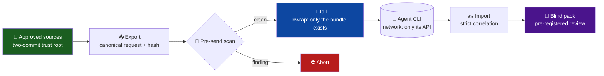

<div align="center">

# 🚪 agent-airlock

### Run untrusted **agentic model CLIs** without giving them your disk.

*An airlock between an AI agent and your machine: what you didn't mount doesn't exist for it — and everything you send is hashed, scanned and auditable after the fact.*


-555)


</div>

---

You want a frontier agent — `codex exec`, `claude -p`, any CLI that wraps a model with tools — to work on a prompt you built. You do **not** want it reading the rest of your filesystem: the answer key of the benchmark you're running it against, your repos, your `/root`. Sandbox flags on the agent's side are promises; `agent-airlock` replaces the promise with **structure**: a bubblewrap jail where the forbidden paths *do not exist*, plus a transport that makes every invocation **auditable** (canonical request hashing, strict correlation, pre-send scanning, sealed source manifests, blinded review packs).

Born from a real need: benchmarking a remote agent as the *executor* of a therapy-protocol evaluation, where the model must never see the expert's corrected answers — not by courtesy, but by construction. The first probe showed the agent's own `read-only` sandbox happily reading the sealed answer keys. This toolkit is what fixed it.



## Table of contents

- [What it does](#what-it-does)
- [The threat model](#-the-threat-model) ← *read this first*
- [The five pieces](#the-five-pieces)
- [Quickstart](#quickstart)
- [The guarantee ladder](#the-guarantee-ladder)
- [Field notes](#field-notes)
- [Repository layout](#repository-layout)
- [Credits & license](#credits--license)

## What it does

| | Capability | How |
|---|---|---|
| 🚪 | **Structural isolation** | bwrap jail with an enumerated minimal root: jail HOME (auth only), empty workdir, results mount. Everything else is *not there* |
| 🔎 | **Provable from inside** | An acceptance probe runs *inside* the jail: `stat`/`open` on forbidden paths must fail; a parent-env canary must be invisible |
| #️⃣ | **Auditable invocations** | One canonical request dict — prompt **and** full invocation config — hashed; responses that don't correlate are rejected |
| 🧪 | **Payload hygiene** | Allowlist construction first; arm-aware deny-scan (normalized prose, distinctive serialization, authorized-values exclusion) as defense in depth |
| 🌱 | **Sealed sources** | Two-commit trust root: commit A freezes code+assets, commit B adds only the manifest, verified structurally — no self-referential hash |
| 🙈 | **Honest human review** | Pre-registered blind packs: composition fixed before outputs exist; `blind/` and `sealed/` physically separated |

## ⚠️ The threat model

Be honest about what this protects and what it doesn't:

- **Protects: your filesystem from the agent.** Inside the jail the agent can read only what you mounted. This is kernel-enforced (mount namespaces), not a flag the agent's runtime interprets.
- **Does NOT protect: the agent's own credential.** The CLI needs its `auth.json` to authenticate; it lives inside the jail and the agent can read it. Scope your tokens accordingly.
- **Does NOT close the network.** Agents need their API. That means *anything you put in the prompt can leave*. This is why the jail is inseparable from payload hygiene: build prompts by **allowlist** from hash-verified sources, scan before sending, fail closed.
- **Correlation is operator attestation** unless your transport returns objective receipts. The import records which one you got — never claim more than you can prove.
- Linux-only (bubblewrap, user namespaces). If `bwrap` is missing, everything refuses to run. There is no degraded mode by design.

## The five pieces

```python
from airlock import jail, transport, trustroot, scan, blindpack
```

1. **`jail`** — `JailSpec` (what exists inside) → `bwrap_command` / `run_in_jail` / `probe`. The probe is the acceptance test: run it before trusting any setup.
2. **`transport`** — `export_requests(case_ids, build_request, pre_send_check, out)` writes one canonical request per case (sha256 over prompt + model + effort + isolation config); `import_responses(...)` enforces the expected set and per-case hash correlation.
3. **`trustroot`** — `build_manifest(repo, files)` at commit A; commit the manifest alone as commit B; `verify(repo, approved, relpath)` checks `diff A..HEAD == [manifest]`, clean tree, and every blob against A. Any later commit demands a new pair.
4. **`scan`** — `build_denyset(prose_fields, distinctive_values, authorized_values)` + `scan(text, denyset)`. Atomic tokens are never scanned (false positives); authorized inputs of the current arm are excluded by design.
5. **`blindpack`** — `build(preregistration, outputs_by_arm, out, instructions)`: refuses missing comparators per the pre-registered policy, emits `blind/` (structural key allowlist — content is *not* word-scanned, legitimate answers may contain any word) and `sealed/` (the key + mechanical conformity proof).

## Quickstart

```bash
git clone https://github.com/Mar-IA-no/agent-airlock
cd agent-airlock
python3 -m pytest tests -q          # 15 tests; jail tests need bwrap

# see a real agent run inside the jail (needs codex CLI + auth):
./examples/codex_exec_in_jail.sh
```

Minimal jail in Python:

```python
from pathlib import Path
from airlock.jail import JailSpec, probe, run_in_jail

spec = JailSpec(jail_home=Path("jail_home"), workdir=Path("empty"), network=True)
report = probe(spec, ["/root", "/home", str(Path.cwd())])
assert report["isolated"]           # forbidden paths don't exist inside
run_in_jail(spec, ["codex", "exec", "--sandbox", "read-only", "--", "your prompt"])
```

## The guarantee ladder

Doctrine distilled from three adversarial audit loops (each rung is weaker — say out loud which one you're standing on):

| Rung | Claim | Backed by |
|---|---|---|
| **Structural** | "The agent *cannot* read X" | Mount namespace + inside-probe. This toolkit's home turf |
| **Procedural** | "We only *sent* clean material" | Allowlist construction + hash-verified sources + pre-send scan |
| **Attestation** | "The operator *says* this response matches that request" | Correlation hashes without receipts — honest, but not proof |

A system that claims rung 1 while standing on rung 3 fails its first serious audit. The APIs here make the rung explicit in their outputs.

## Field notes

- **The agent's own sandbox is not your boundary.** Our first probe ran an agent CLI with `--sandbox read-only` and a temp cwd: it listed the host repo and read the sealed benchmark cases. Reads were unrestricted; only writes were sandboxed. The jail exists because of that afternoon.
- **A manifest cannot contain the hash of its own commit.** The two-commit protocol (B identified structurally as "the only diff against A") came from hitting this bootstrap in practice, twice.
- **Don't word-scan blinded content.** A legitimate therapy-journey answer may contain the word "luna" — and your model is called Luna. Blind by *structure* (allowed keys), not by grepping names.
- **Exit early, loudly.** Every component here prefers aborting to degrading: no bwrap → refuse; scan finding → refuse; missing comparator → refuse; dirty tree → refuse.

## Repository layout

```
airlock/
├── jail.py        # bwrap spec/command/probe — structural isolation
├── transport.py   # canonical requests, export/import, strict correlation
├── trustroot.py   # two-commit approved-sources protocol
├── scan.py        # allowlist-first payload hygiene
└── blindpack.py   # pre-registered blinded review packs
tests/             # 15 offline tests (jail tests skip without bwrap)
examples/          # codex exec inside the jail, end to end
```

## Credits & license

Extracted from the evaluation instrument of a live project, where the design survived three adversarial audit loops (trajectories 5→0 and 6→6→5→3→3) before its first real run: 9/9 cases executed by a remote frontier agent that could not — verifiably — read the answer key sitting on the same disk.

Released under the [MIT](LICENSE) license.

---

<div align="center">
<sub>What you didn't mount doesn't exist. Everything else is a promise.</sub>
</div>
